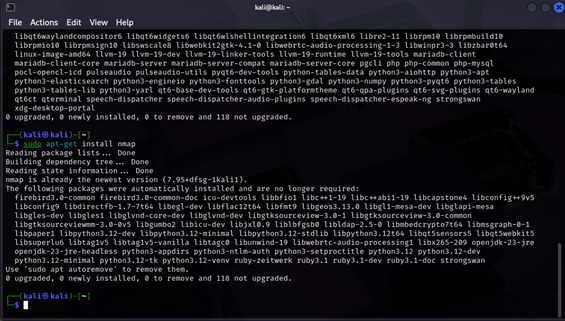
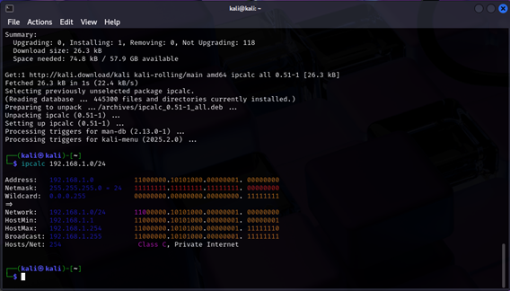
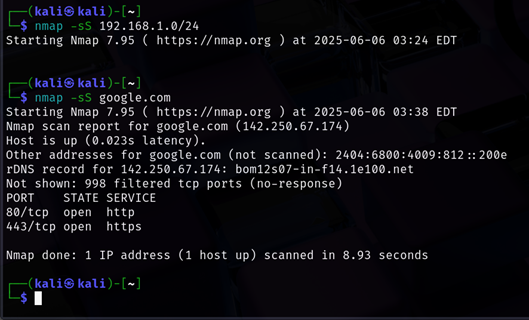

## 1.Install Nmap from official website.

## 2.Find your local IP range (e.g., 192.168.1.0/24).

## 3.Run: nmap -sS 192.168.1.0/24 to perform TCP SYN scan.

## 4.Note down IP addresses and open ports found.

## 5.Optionally analyze packet capture with Wireshark.

## 6.Research common services running on those ports.

## 7.Identify potential security risks from open ports.

## 8.Save scan results as a text or HTML file.

